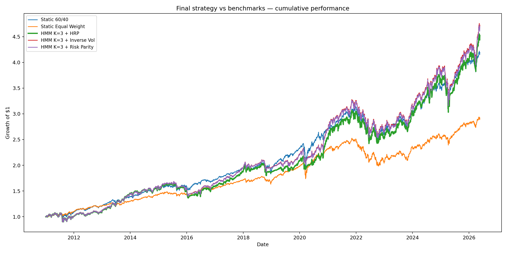
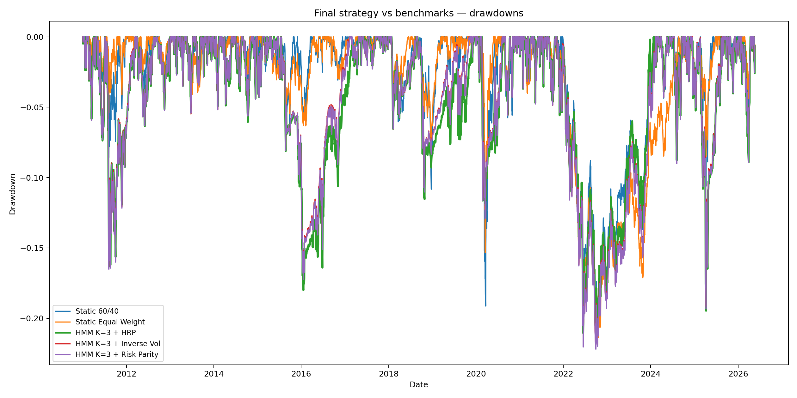
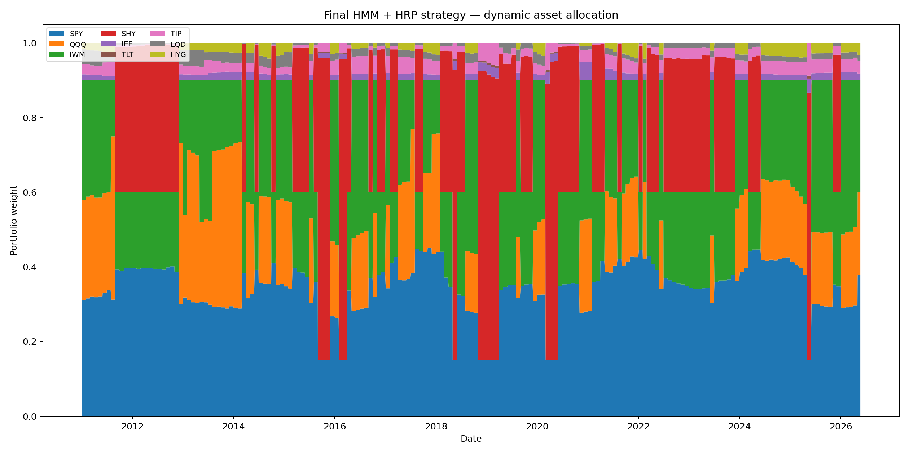
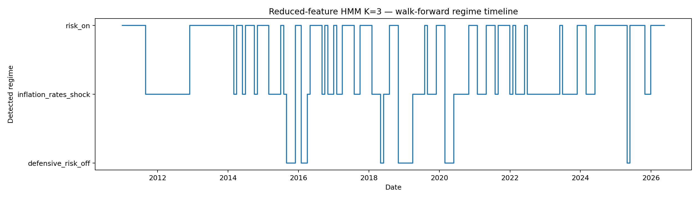
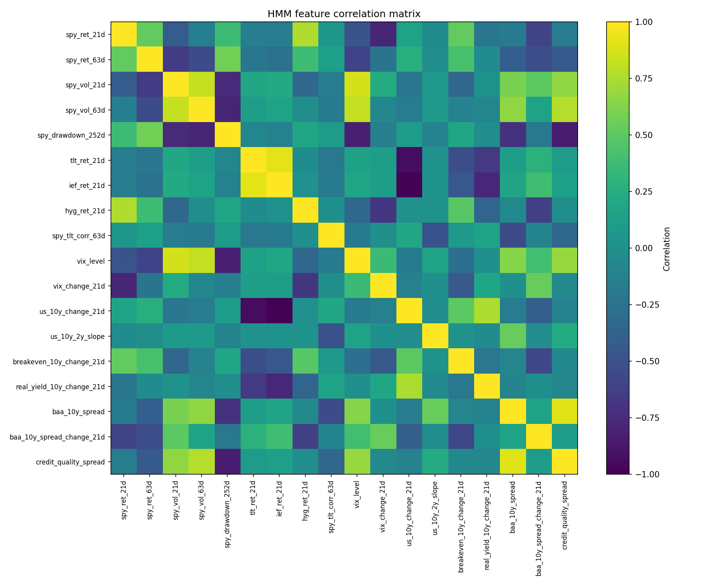

# Dynamic Multi-Asset Allocation Strategy

This project develops a dynamic multi-asset allocation strategy between equities and fixed income assets. The objective is to use macro-financial regime detection to adapt portfolio weights through time, and to compare the resulting allocation against standard static benchmarks such as a 60/40 portfolio.

The final strategy combines:

* a **Gaussian Hidden Markov Model** for market regime detection;
* a **reduced macro-financial feature set** to avoid redundant risk signals;
* a **5-year rolling walk-forward training framework** to avoid look-ahead bias;
* **Hierarchical Risk Parity** for portfolio construction;
* explicit **transaction costs**;
* comparison with static and risk-based benchmarks.

The retained final model is:

```text
Reduced-feature Gaussian HMM
K = 3 hidden regimes
Covariance type = full
Training window = rolling 5 years
Allocation method = HRP
Transaction costs = 5 bps
```

---

## 1. Project Overview

The central idea is that financial markets evolve through different latent regimes. These regimes are not directly observable, but they can be inferred from market and macro-financial variables such as equity momentum, volatility, credit risk, interest rates, and equity-bond correlation.

The complete pipeline is:

```text
Market data
→ Feature engineering
→ HMM regime detection
→ Regime-dependent equity / fixed income allocation
→ HRP / Risk Parity / inverse-volatility weighting
→ Walk-forward backtest
→ Performance analysis
```

The project is designed as an end-to-end quantitative allocation framework. It includes data download, feature construction, regime detection, portfolio construction, backtesting, transaction costs, benchmark comparison, and final reporting.

---

## 2. Final Results

The final retained strategy is:

```text
HMM K=3 + reduced features + HRP + 5 bps transaction costs
```

The final results are reported on a common evaluation period so that all strategies are compared over the same horizon.

| Strategy              | Final value |   CAGR | Volatility | Sharpe | Sortino | Max drawdown | Calmar | Turnover | Transaction costs |
| --------------------- | ----------: | -----: | ---------: | -----: | ------: | -----------: | -----: | -------: | ----------------: |
| Static 60/40          |        4.19 |  9.79% |      9.97% |   0.99 |    1.24 |      -21.02% |   0.47 |     0.00 |             0.00% |
| Static Equal Weight   |        2.92 |  7.23% |      7.63% |   0.95 |    1.22 |      -21.37% |   0.34 |     0.00 |             0.00% |
| HMM K=3 + HRP         |        4.52 | 10.33% |     12.66% |   0.84 |    1.06 |      -21.06% |   0.49 |    57.82 |             2.89% |
| HMM K=3 + Inverse Vol |        4.73 | 10.64% |     12.74% |   0.86 |    1.08 |      -22.10% |   0.48 |    47.64 |             2.38% |
| HMM K=3 + Risk Parity |        4.69 | 10.60% |     12.78% |   0.85 |    1.07 |      -22.20% |   0.48 |    48.48 |             2.42% |

The final HMM + HRP strategy achieves:

* a higher CAGR than the static 60/40 benchmark;
* a higher Calmar ratio than the static 60/40 benchmark;
* a maximum drawdown almost identical to the 60/40 benchmark;
* a lower Sharpe ratio due to higher volatility;
* higher turnover, as expected for a dynamic allocation strategy.

The conclusion is therefore not that the dynamic strategy dominates the benchmark on every metric. Rather, the final HMM + HRP strategy improves **drawdown-adjusted performance** while keeping the maximum drawdown comparable to the 60/40 benchmark.

---

## 3. Final Figures

### Cumulative performance



### Drawdowns



### Dynamic asset allocation



### HMM regime timeline



### Feature correlation heatmap



---

## 4. Investment Universe

The strategy is US-centric and uses liquid ETFs to represent broad asset classes.

### Equity assets

| Ticker | Asset class                     | Interpretation        |
| ------ | ------------------------------- | --------------------- |
| SPY    | US large-cap equities           | S&P 500 exposure      |
| QQQ    | US growth / technology equities | Nasdaq-100 exposure   |
| IWM    | US small-cap equities           | Russell 2000 exposure |

### Fixed income assets

| Ticker | Asset class             | Interpretation                       |
| ------ | ----------------------- | ------------------------------------ |
| SHY    | Short-term Treasuries   | Low-duration defensive bond exposure |
| IEF    | Intermediate Treasuries | Medium-duration Treasury exposure    |
| TLT    | Long-term Treasuries    | Long-duration Treasury exposure      |
| TIP    | Inflation-linked bonds  | Inflation-protected fixed income     |
| LQD    | Investment-grade credit | Corporate bond exposure              |
| HYG    | High-yield credit       | Risky credit exposure                |

The equity universe captures different segments of US equities, while the fixed income universe captures duration, inflation protection, investment-grade credit, and high-yield credit.

---

## 5. Data

The project uses three broad categories of data.

### 5.1 Investable asset prices

ETF prices are downloaded and transformed into daily returns.

The investable assets are:

```text
SPY, QQQ, IWM, SHY, IEF, TLT, TIP, LQD, HYG
```

Daily returns are computed as:

$$
r_t^{(i)} = \frac{P_t^{(i)}}{P_{t-1}^{(i)}} - 1
$$

where:

* $P_t^{(i)}$ is the adjusted price of asset $i$ at date $t$;
* $r_t^{(i)}$ is the daily return.

These returns are used both for portfolio construction and for backtesting.

### 5.2 Market stress data

The VIX index is used as an implied volatility and equity stress indicator.

A high VIX is generally associated with:

* higher expected volatility;
* higher risk aversion;
* stress in equity markets;
* wider risk premia.

### 5.3 Macro-financial data

The macro-financial data includes:

| Variable            | Interpretation                            |
| ------------------- | ----------------------------------------- |
| US 2Y yield         | Short-rate / monetary policy expectations |
| US 10Y yield        | Long-term nominal interest rate           |
| 10Y - 2Y slope      | Yield curve slope                         |
| Breakeven inflation | Market-implied inflation compensation     |
| Real yield          | Inflation-adjusted long-term rate         |
| Credit spreads      | Corporate credit risk indicators          |

These variables help the HMM distinguish between different types of regimes, for example an equity stress regime versus an inflation/rates shock regime.

---

## 6. Feature Engineering

The HMM does not use raw prices directly. It uses macro-financial features designed to capture the state of markets.

The initial feature set included equity momentum, realized volatility, drawdowns, bond returns, credit indicators, interest-rate changes, inflation indicators, and equity-bond correlation.

Examples of features:

| Feature                     | Interpretation                     |
| --------------------------- | ---------------------------------- |
| `spy_ret_21d`               | 21-day equity momentum             |
| `spy_ret_63d`               | 63-day equity momentum             |
| `spy_vol_21d`               | 21-day realized equity volatility  |
| `spy_vol_63d`               | 63-day realized equity volatility  |
| `spy_drawdown_252d`         | 1-year equity drawdown             |
| `tlt_ret_21d`               | Long-duration Treasury performance |
| `hyg_ret_21d`               | High-yield credit performance      |
| `spy_tlt_corr_63d`          | Rolling equity-bond correlation    |
| `vix_level`                 | Implied volatility / market stress |
| `us_10y_change_21d`         | 21-day change in nominal 10Y yield |
| `real_yield_10y_change_21d` | 21-day change in real yield        |
| `credit_quality_spread`     | Relative credit stress indicator   |

Rolling returns are computed as:

$$
R_{t,h} = \frac{P_t}{P_{t-h}} - 1
$$

Rolling volatility is computed as:

$$
\sigma_{t,h} = \sqrt{252} \cdot \operatorname{Std}(r_{t-h+1}, \dots, r_t)
$$

Rolling correlation between equities and bonds is computed as:

$$
\rho_{t,h}^{SPY,TLT}
====================

\operatorname{Corr}\left(r_{t-h+1:t}^{SPY}, r_{t-h+1:t}^{TLT}\right)
$$

Drawdown is computed as:

$$
DD_t = \frac{P_t}{\max_{s \leq t} P_s} - 1
$$

These features are designed to capture the main state variables relevant for multi-asset allocation:

* equity trend;
* volatility;
* credit risk;
* interest-rate shocks;
* inflation/rates dynamics;
* equity-bond diversification.

---

## 7. Why Reduce the HMM Feature Set?

The initial HMM feature set contained several highly correlated variables. This is problematic because the HMM may effectively receive the same economic signal multiple times.

For example, the following variables often move together during equity stress periods:

```text
spy_vol_21d
spy_vol_63d
vix_level
spy_drawdown_252d
credit spreads
```

During market stress, equity volatility rises, the VIX increases, drawdowns deepen, and credit spreads widen. Feeding all these variables into the HMM may overweight the same “stress” signal and lead to very confident regime classifications.

The feature correlation heatmap confirms the existence of several redundant blocks:

* an equity stress / volatility block;
* a credit risk block;
* a Treasury duration block;
* a rates block.

To reduce redundancy, the final HMM uses a parsimonious feature set with one or two representative variables per economic dimension.

### Final reduced HMM feature set

| Feature                     | Economic dimension                 |
| --------------------------- | ---------------------------------- |
| `spy_ret_63d`               | Medium-term equity momentum        |
| `spy_vol_21d`               | Realized equity volatility         |
| `tlt_ret_21d`               | Long-duration Treasury behavior    |
| `hyg_ret_21d`               | High-yield credit risk appetite    |
| `spy_tlt_corr_63d`          | Equity-bond diversification regime |
| `vix_level`                 | Implied volatility / equity stress |
| `us_10y_change_21d`         | Nominal rate shock                 |
| `real_yield_10y_change_21d` | Real rate shock                    |
| `credit_quality_spread`     | Relative credit stress             |

The final reduced feature set is therefore not chosen mechanically. It is motivated by both:

1. the empirical correlation structure of the initial features;
2. the economic interpretation of each variable.

The reduced-feature HMM produced more useful regime signals in the backtest than the original larger feature set.

---

## 8. Hidden Markov Model

A Hidden Markov Model is a probabilistic model for systems that move through unobserved latent states.

In this project, the hidden states correspond to market regimes.

Let:

* $X_t$ be the observed feature vector at date $t$;
* $Z_t$ be the hidden regime at date $t$;
* $K$ be the number of regimes.

The hidden regime is:

$$
Z_t \in {1, \dots, K}
$$

The HMM assumes that the hidden states follow a Markov chain:

$$
\mathbb{P}(Z_t = j \mid Z_{t-1}=i, Z_{t-2}, \dots)
==================================================

\mathbb{P}(Z_t = j \mid Z_{t-1}=i)
$$

The transition probabilities are summarized by a transition matrix:

$$
A_{ij} = \mathbb{P}(Z_t = j \mid Z_{t-1} = i)
$$

Each row of $A$ sums to one.

### Gaussian HMM

The project uses a Gaussian HMM. This means that the observed features are assumed to be normally distributed conditional on the hidden regime:

$$
X_t \mid Z_t = k \sim \mathcal{N}(\mu_k, \Sigma_k)
$$

where:

* $\mu_k$ is the regime-specific mean vector;
* $\Sigma_k$ is the regime-specific covariance matrix.

The final model uses:

```text
covariance_type = full
```

This means that each regime has its own full covariance matrix. The model can therefore capture correlations between the selected features inside each regime.

### Posterior regime probabilities

Once trained, the HMM estimates probabilities of the form:

$$
\mathbb{P}(Z_t = k \mid X_1, \dots, X_t)
$$

These probabilities indicate how likely each regime is at the current date, given the information available up to that date.

In the final strategy, the dominant regime is:

$$
\hat{Z}_t = \arg\max_k \mathbb{P}(Z_t = k \mid X_1, \dots, X_t)
$$

The allocation is then based on this detected regime.

---

## 9. Avoiding Look-Ahead Bias

A key point of the project is that regime detection must not use future information.

The final HMM is trained in a walk-forward framework.

At each month-end decision date $t$:

1. only past data up to date $t$ is used;
2. features are standardized using only the training window;
3. the HMM is trained only on the past 5 years of features;
4. the current regime at date $t$ is inferred;
5. the allocation is applied from the next trading day onward.

The rolling training window is:

$$
[t - 5\text{ years}, t]
$$

This ensures that the model never observes future returns or future regimes when making an allocation decision.

The benchmark strategies and HMM strategies are also compared on a common evaluation period to avoid comparing strategies over different horizons.

---

## 10. Choice of the Number of Regimes

The HMM was tested with different numbers of hidden states:

```text
K = 2, 3, 4, 5
```

The objective was not simply to maximize in-sample likelihood. A useful regime model should also produce:

* economically interpretable regimes;
* persistent regimes;
* reasonable regime frequencies;
* stable walk-forward signals;
* useful allocation performance.

### Interpretation of different values of K

| Number of regimes | Interpretation                                                           | Limitation                                    |
| ----------------: | ------------------------------------------------------------------------ | --------------------------------------------- |
|             K = 2 | Separates broadly normal markets from stressed markets                   | Too coarse                                    |
|             K = 3 | Separates risk-on, inflation/rates shock, and defensive risk-off regimes | Good robustness/interpretablity trade-off     |
|             K = 4 | Adds a recovery/normalization regime                                     | More detailed but less stable in walk-forward |
|             K = 5 | Creates additional mixed/neutral regimes                                 | Risk of over-segmentation                     |

The final model keeps:

```text
K = 3
```

This choice is based on the trade-off between interpretability, stability, and backtest performance.

The 4-regime model was economically richer, but it produced more regime switches in walk-forward testing. The 5-regime model was rejected because it created less interpretable mixed regimes and was more unstable.

---

## 11. Economic Interpretation of Regimes

The final 3-regime HMM produces three broad macro-financial regimes.

### 11.1 Risk-on regime

Typical characteristics:

* positive equity momentum;
* lower volatility;
* tighter credit spreads;
* better high-yield performance;
* generally favorable risky asset environment.

Allocation intuition:

* higher equity exposure;
* some credit exposure;
* lower defensive bond allocation.

### 11.2 Inflation / rates shock regime

Typical characteristics:

* adverse bond performance;
* rising nominal or real yields;
* weaker duration assets;
* possibly positive equity-bond correlation;
* reduced diversification benefit from long Treasuries.

Allocation intuition:

* avoid excessive long-duration exposure;
* use shorter-duration and inflation-linked bonds;
* keep equity exposure but reduce sensitivity to rate shocks.

### 11.3 Defensive risk-off regime

Typical characteristics:

* equity sell-off;
* high volatility;
* stress in credit markets;
* flight-to-quality behavior;
* defensive Treasury assets may outperform.

Allocation intuition:

* reduce equity exposure;
* increase defensive fixed income exposure;
* avoid high-yield and risky credit concentration.

---

## 12. Regime-Dependent Allocation Policy

The HMM does not directly output portfolio weights. It outputs a detected market regime.

A regime allocation policy then maps each regime into:

1. an equity weight;
2. a fixed income weight;
3. a list of eligible equity assets;
4. a list of eligible fixed income assets.

The generic logic is:

```text
HMM regime
→ equity / bond budget
→ eligible asset universe
→ HRP allocation inside buckets
```

For example:

| Regime                | Equity budget | Fixed income budget | Allocation intuition                       |
| --------------------- | ------------: | ------------------: | ------------------------------------------ |
| Risk-on               |          High |      Low / moderate | Capture risky asset performance            |
| Inflation/rates shock |      Moderate |            Moderate | Avoid excessive duration risk              |
| Defensive risk-off    |           Low |                High | Reduce drawdowns and seek defensive assets |

The HMM provides the macro-financial state. HRP, inverse volatility, or Risk Parity then determine the relative weights inside the eligible asset buckets.

---

## 13. Portfolio Construction Methods

The project compares several portfolio construction methods.

### 13.1 Equal weight

Equal weighting assigns the same weight to every asset in a selected bucket.

For $N$ assets:

$$
w_i = \frac{1}{N}
$$

This is simple and robust, but it ignores volatility and correlations.

### 13.2 Inverse-volatility allocation

Inverse-volatility weighting assigns larger weights to less volatile assets:

$$
w_i \propto \frac{1}{\sigma_i}
$$

After normalization:

$$
w_i = \frac{1/\sigma_i}{\sum_{j=1}^{N} 1/\sigma_j}
$$

This method controls single-asset volatility but does not explicitly account for correlations.

### 13.3 Risk Parity

Risk Parity aims to equalize the contribution of each asset to total portfolio risk.

Portfolio volatility is:

$$
\sigma_p = \sqrt{w^\top \Sigma w}
$$

The marginal contribution to risk of asset $i$ is:

$$
\frac{\partial \sigma_p}{\partial w_i}
= \frac{(\Sigma w)_i}{\sigma_p}
$$

The total risk contribution of asset $i$ is:

$$
RC_i = w_i \frac{(\Sigma w)_i}{\sigma_p}
$$

A Risk Parity portfolio seeks:

$$
RC_i = RC_j \quad \forall i,j
$$

This method uses both volatility and correlation through the covariance matrix.

### 13.4 Hierarchical Risk Parity

Hierarchical Risk Parity is a risk-based allocation method that uses clustering to organize assets before allocating capital.

The HRP algorithm has four main steps:

1. estimate the correlation matrix;
2. convert correlations into distances;
3. apply hierarchical clustering;
4. allocate recursively between clusters according to cluster variance.

The correlation distance is:

$$
d_{ij} = \sqrt{\frac{1 - \rho_{ij}}{2}}
$$

where $\rho_{ij}$ is the correlation between assets $i$ and $j$.

HRP is useful because it avoids directly inverting the covariance matrix, which can be unstable when assets are highly correlated. It also reduces concentration in groups of similar assets.

In this project, HRP is the final retained allocation method because it provides the best Calmar ratio among the HMM-based strategies.

---

## 14. Transaction Costs

The backtest includes proportional transaction costs.

At each rebalancing date, turnover is computed as:

$$
\text{Turnover}*t = \sum_i |w*{t,i}^{new} - w_{t,i}^{old}|
$$

Transaction cost is then:

$$
\text{Cost}_t = c \times \text{Turnover}_t
$$

where $c$ is the transaction cost rate.

The final backtest uses:

```text
c = 5 bps = 0.05%
```

The net strategy return is:

$$
r_t^{net} = r_t^{gross} - \text{Cost}_t
$$

This penalizes dynamic strategies with high turnover.

---

## 15. Backtest Methodology

The backtest follows a realistic walk-forward logic.

At each monthly decision date:

1. train the HMM using only past data;
2. infer the current regime;
3. determine the regime-dependent equity/bond allocation;
4. estimate risk-based weights using only past asset returns;
5. apply the new weights from the next trading day;
6. subtract transaction costs.

The portfolio return is:

$$
r_{p,t} = \sum_{i=1}^{N} w_{t-1,i} r_{t,i}
$$

where:

* $w_{t-1,i}$ is the portfolio weight decided before return $r_{t,i}$ is realized;
* this convention avoids using same-day future information.

All final metrics are computed over a common period shared by all compared strategies.

---

## 16. Performance Metrics

### 16.1 Cumulative return and final value

The equity curve is:

$$
V_t = \prod_{s=1}^{t} (1 + r_s)
$$

The final value is the ending value of a $1 initial investment.

### 16.2 CAGR

The compound annual growth rate is:

$$
\text{CAGR} = \left(\frac{V_T}{V_0}\right)^{1/Y} - 1
$$

where $Y$ is the number of years.

### 16.3 Annualized volatility

Daily volatility is annualized as:

$$
\sigma_{ann} = \sqrt{252} \cdot \operatorname{Std}(r_t)
$$

### 16.4 Sharpe ratio

Assuming a zero risk-free rate approximation, the Sharpe ratio is:

$$
\text{Sharpe} = \frac{\mathbb{E}[r_t] \times 252}{\operatorname{Std}(r_t) \times \sqrt{252}}
$$

### 16.5 Sortino ratio

The Sortino ratio penalizes only downside volatility:

$$
\text{Sortino} = \frac{R_{ann}}{\sigma_{downside}}
$$

where downside volatility is computed using only negative returns.

### 16.6 Maximum drawdown

Drawdown is:

$$
DD_t = \frac{V_t}{\max_{s \leq t} V_s} - 1
$$

Maximum drawdown is:

$$
\text{MDD} = \min_t DD_t
$$

### 16.7 Calmar ratio

The Calmar ratio measures annualized return per unit of maximum drawdown:

$$
\text{Calmar} = \frac{\text{CAGR}}{|\text{MDD}|}
$$

This metric is particularly relevant for this project because the objective is not only to improve returns, but also to control large losses.

---

## 17. Interpretation of Results

The final HMM + HRP strategy improves the Calmar ratio relative to the 60/40 benchmark.

The result can be interpreted as follows:

* the HMM regime detection adds a tactical macro-financial overlay;
* the reduced feature set avoids over-weighting redundant stress signals;
* HRP provides diversified risk-based allocation inside regime-specific asset buckets;
* the strategy captures more upside than the initial conservative HMM allocation;
* the maximum drawdown remains close to the 60/40 benchmark;
* the higher volatility explains why the Sharpe ratio remains below the 60/40 benchmark.

The project therefore supports the idea that regime-switching allocation can improve drawdown-adjusted performance, but it also shows that regime models must be carefully designed. A larger feature set or too many regimes can produce less stable signals and worse allocation performance.

---

## 18. Experiments and Model Selection

Several variants were tested during the project.

### 18.1 Number of HMM regimes

The model was tested with:

```text
K = 2, 3, 4, 5
```

The final choice was $K=3$ because it offered the best compromise between:

* economic interpretability;
* stability;
* backtest performance.

### 18.2 Full versus reduced feature set

The initial feature set was too redundant. The reduced feature set improved the usefulness of the regimes for allocation.

The best HMM-based strategy came from:

```text
Reduced features + covariance_type = full
```

The diagonal covariance version produced less extreme probabilities at some dates, but it did not improve the allocation performance.

### 18.3 Rolling versus expanding training window

An expanding-window HMM was also tested. It did not improve the final strategy.

The rolling 5-year window remained preferable because it provided a better balance between:

* enough data to estimate regimes;
* enough adaptivity to changing market conditions.

### 18.4 Allocation methods

The project compares:

* equal weight;
* inverse volatility;
* Risk Parity;
* HRP.

HRP was retained as the final allocation method because it achieved the best drawdown-adjusted performance among the HMM-based strategies.

---

## 19. Limitations

This project is a research prototype and has several limitations.

### 19.1 Gaussian assumption

The Gaussian HMM assumes:

$$
X_t \mid Z_t = k \sim \mathcal{N}(\mu_k, \Sigma_k)
$$

Financial data often exhibit fat tails, skewness, nonlinear dependencies, and outliers. Therefore, the Gaussian assumption is an approximation.

### 19.2 Constant transition probabilities

The HMM assumes that transition probabilities are constant over time:

$$
A_{ij} = \mathbb{P}(Z_t=j \mid Z_{t-1}=i)
$$

In reality, regime transition probabilities may depend on macro-financial variables.

### 19.3 Model selection bias

Several variants were tested. Although the final model is economically motivated, the process may introduce model selection bias. A stricter validation framework could use a separate design period and final out-of-sample period.

### 19.4 Transaction cost simplification

The backtest uses proportional transaction costs. It does not model bid-ask spreads dynamically, market impact, ETF liquidity differences, or taxes.

### 19.5 ETF-based representation

The investment universe is limited to liquid ETFs. This makes the backtest practical and interpretable, but it does not capture the full richness of institutional multi-asset allocation.

---

## 20. Possible Extensions

Several extensions could improve the project.

### 20.1 PCA-HMM

A PCA transformation could be applied before the HMM:

```text
standardized features
→ PCA factors
→ HMM regime detection
```

This could further reduce feature redundancy, but would reduce direct interpretability.

### 20.2 Student-t HMM

A Student-t HMM could better capture fat-tailed financial data.

### 20.3 Time-varying transition probabilities

Instead of constant transition probabilities, one could use:

$$
\mathbb{P}(Z_{t+1}=j \mid Z_t=i, X_t)
$$

where transition probabilities depend on observable macro-financial variables.

### 20.4 Turnover-threshold rebalancing

Instead of rebalancing monthly, the strategy could rebalance only when the target portfolio differs sufficiently from the current portfolio:

$$
\sum_i |w_i^{target} - w_i^{current}| > \theta
$$

This could reduce unnecessary turnover.

### 20.5 Volatility targeting

The strategy could target a fixed volatility level by scaling exposure according to realized volatility.

### 20.6 Out-of-sample validation split

A final robustness check could split the project into:

```text
Design period: choose model and features
Validation period: evaluate final model only
```

This would reduce model selection bias.

---

## 21. Repository Structure

```text
dynamic-multi-asset-allocation/
│
├── README.md
├── requirements.txt
├── config.yaml
│
├── data/
│   ├── raw/
│   └── processed/
│
├── scripts/
│   ├── 01_download_data.py
│   ├── 02_build_features.py
│   ├── 03_hmm_descriptive_analysis.py
│   ├── 04_hmm_walk_forward.py
│   ├── 05_backtest_regime_strategy.py
│   ├── 08_test_reduced_features_hmm.py
│   ├── 09_backtest_reduced_features_hmm.py
│   ├── 10_feature_correlation_analysis.py
│   └── 12_generate_final_report_outputs.py
│
├── src/
│   ├── data_loader.py
│   ├── features.py
│   ├── hmm_regimes.py
│   ├── portfolio_construction.py
│   └── backtest.py
│
└── reports/
    ├── backtests/
    ├── features/
    ├── final/
    └── hmm/
```

---

## 22. How to Run the Project

Create and activate a virtual environment:

```powershell
python -m venv .venv
.\.venv\Scripts\Activate.ps1
```

Install dependencies:

```powershell
pip install -r requirements.txt
```

Download raw data:

```powershell
python scripts\01_download_data.py
```

Build features:

```powershell
python scripts\02_build_features.py
```

Run descriptive HMM analysis:

```powershell
python scripts\03_hmm_descriptive_analysis.py
```

Run walk-forward HMM regime detection:

```powershell
python scripts\04_hmm_walk_forward.py
```

Run the base backtest:

```powershell
python scripts\05_backtest_regime_strategy.py
```

Run reduced-feature HMM experiments:

```powershell
python scripts\08_test_reduced_features_hmm.py
python scripts\09_backtest_reduced_features_hmm.py
```

Run feature correlation analysis:

```powershell
python scripts\10_feature_correlation_analysis.py
```

Generate final report outputs:

```powershell
python scripts\12_generate_final_report_outputs.py
```

---

## 23. Final Takeaway

The final strategy shows that a parsimonious regime-switching framework can improve drawdown-adjusted performance relative to a static 60/40 benchmark.

The most important lesson from the project is that the HMM itself is only one part of the allocation pipeline. The quality of the final strategy depends on:

* economically meaningful features;
* avoiding redundant signals;
* a walk-forward design without look-ahead bias;
* a reasonable number of regimes;
* a robust mapping from regimes to portfolio weights;
* disciplined portfolio construction and transaction cost modeling.

The final retained approach is therefore:

```text
Reduced-feature Gaussian HMM
+ 3 interpretable regimes
+ 5-year rolling walk-forward training
+ regime-dependent equity/fixed income allocation
+ HRP portfolio construction
+ transaction-cost-aware backtest
```

This combination delivers a higher CAGR and Calmar ratio than the static 60/40 benchmark, with a comparable maximum drawdown, after transaction costs.
